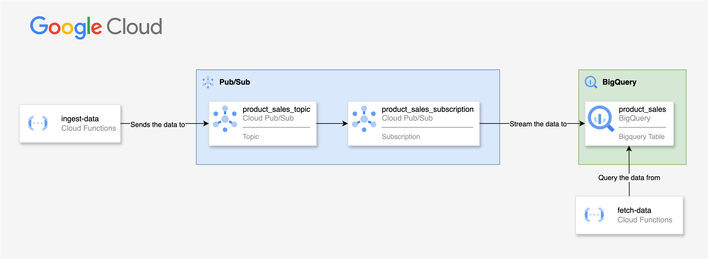

# latam-challenge

[](https://github.com/cristian-rincon/latam-challenge/actions/workflows/ci.yaml)
[](https://github.com/cristian-rincon/latam-challenge/actions/workflows/cd.yaml)

## Contenidos

- [latam-challenge](#latam-challenge)
  - [Contenidos](#contenidos)
  - [Objetivo](#objetivo)
  - [Solución](#solución)
  - [Setup](#setup)
    - [Pre-requisitos](#pre-requisitos)
      - [Opcional](#opcional)
    - [Apis que se deben habilitar](#apis-que-se-deben-habilitar)
  - [1. Infraestructura](#1-infraestructura)
    - [1.1 Inicialización](#11-inicialización)
    - [1.2 Plan](#12-plan)
    - [1.3 Apply](#13-apply)
  - [2. Aplicaciones y Flujo de CI/CD](#2-aplicaciones-y-flujo-de-cicd)
    - [2.1 Ingesta de Datos (HTTP API)](#21-ingesta-de-datos-http-api)
    - [2.2 Consulta de datos](#22-consulta-de-datos)
  - [3. CI/CD](#3-cicd)
    - [3.1 Estrategia de ramas](#31-estrategia-de-ramas)
    - [3.2 Pre-requisitos de GitHub Actions](#32-pre-requisitos-de-github-actions)
      - [3.2.1 Entornos de GitHub](#321-entornos-de-github)
      - [3.2.2 Recursos necesarios para manejar el estado de terraform en la nube](#322-recursos-necesarios-para-manejar-el-estado-de-terraform-en-la-nube)
      - [3.2.3 Secretos de entorno](#323-secretos-de-entorno)
    - [3.3 Propuesta para Pruebas de Integración del Sistema](#33-propuesta-para-pruebas-de-integración-del-sistema)
      - [3.3.1. Propuesta de Pruebas de Integración](#331-propuesta-de-pruebas-de-integración)
        - [a. **Pruebas de Integración para la Cloud Function que Consulta BigQuery**](#a-pruebas-de-integración-para-la-cloud-function-que-consulta-bigquery)
        - [b. **Pruebas de Integración para la Cloud Function que Publica a Pub/Sub**](#b-pruebas-de-integración-para-la-cloud-function-que-publica-a-pubsub)
      - [3.3.2. Otras Pruebas de Integración Propuestas](#332-otras-pruebas-de-integración-propuestas)
        - [a. **Pruebas de Interacción Completa entre las Cloud Functions, BigQuery y Pub/Sub**](#a-pruebas-de-interacción-completa-entre-las-cloud-functions-bigquery-y-pubsub)
        - [b. **Pruebas de Latencia y Tiempo de Respuesta**](#b-pruebas-de-latencia-y-tiempo-de-respuesta)
      - [3.3.3. Identificación de Puntos Críticos y Propuesta de Pruebas](#333-identificación-de-puntos-críticos-y-propuesta-de-pruebas)
      - [3.3.4. Propuestas para Robustecer el Sistema](#334-propuestas-para-robustecer-el-sistema)
    - [4. Métricas y Monitoreo](#4-métricas-y-monitoreo)
      - [4.1. Propuesta de 3 Métricas Críticas para Evaluar la Salud y Rendimiento del Sistema](#41-propuesta-de-3-métricas-críticas-para-evaluar-la-salud-y-rendimiento-del-sistema)
      - [4.2. Herramienta de Visualización Propuesta: **Google Cloud Monitoring (Stackdriver)**](#42-herramienta-de-visualización-propuesta-google-cloud-monitoring-stackdriver)
      - [4.3. Implementación de la Herramienta de Visualización en la Nube](#43-implementación-de-la-herramienta-de-visualización-en-la-nube)
      - [4.4. Escalamiento a 50 Sistemas Similares y Nuevas Formas de Visualización](#44-escalamiento-a-50-sistemas-similares-y-nuevas-formas-de-visualización)
      - [4.5. Dificultades o Limitaciones en la Observabilidad del Sistema al Escalar](#45-dificultades-o-limitaciones-en-la-observabilidad-del-sistema-al-escalar)
    - [5 Alertas y SRE](#5-alertas-y-sre)
      - [5.1. Reglas y Umbrales para Disparar Alertas](#51-reglas-y-umbrales-para-disparar-alertas)
        - [a. **Latencia de las Cloud Functions**](#a-latencia-de-las-cloud-functions)
        - [b. **Tasa de Errores en Pub/Sub**](#b-tasa-de-errores-en-pubsub)
        - [c. **Tiempos de Consulta en BigQuery**](#c-tiempos-de-consulta-en-bigquery)
      - [5.2. SLIs y SLOs](#52-slis-y-slos)
        - [a. **Latencia de Cloud Functions**](#a-latencia-de-cloud-functions)
        - [b. **Tasa de Errores en Pub/Sub**](#b-tasa-de-errores-en-pubsub-1)
        - [c. **Disponibilidad de BigQuery**](#c-disponibilidad-de-bigquery)
      - [¿Por qué se desecharon otras métricas?](#por-qué-se-desecharon-otras-métricas)

## Objetivo

Desarrollar un sistema en la nube para ingestar, almacenar y exponer datos mediante el uso de IaC y despliegue con flujos CI/CD. Hacer pruebas de calidad, monitoreo y alertas para asegurar y monitorear la salud del sistema.

## Solución

La solución planteada consiste en un sistema que ingesta, almacena y expone datos utilizando recursos de Google Cloud optimizados para un flujo de datos que utilice un esquema pub/sub.

Para esta solución se emplearán los siguientes componentes:

- Google Cloud Platform
  - IAM: Roles y Cuentas de Servicio
  - Pub/Sub: Tópicos y Suscripciones
  - Cloud Run Functions: Ingesta y Consulta de datos
  - Bigquery: Dataset y Tablas para almacenamiento de datos (enfocado en analítica de datos)
- GitHub:
  - Repositorio: Para almacenamiento del código fuente
  - Actions: Para la orquestación de los flujos de CI/CD
  - Entornos: Para manejo de despliegues, secretos, y variables hacia distintos entornos.
  - Seguridad:
    - Avisos: Ver o divulgar avisos de seguridad para este repositorio
    - Alertas de escaneo de secretos: Recibir una notificación cuando se envíe un secreto a este repositorio

## Setup

### Pre-requisitos

- [Gcloud CLI](https://cloud.google.com/sdk/docs/install?hl=es-419)
- [Terraform CLI](https://developer.hashicorp.com/terraform/tutorials/aws-get-started/install-cli)
- [Python 3.9+](https://www.python.org/downloads/)

#### Opcional

- [Terraform Docs](https://terraform-docs.io/)
- [NodeJS](https://nodejs.org/en/download/package-manager) (Pre-requisite for auto-changelog)
- [Auto-Changelog](https://www.npmjs.com/package/auto-changelog)

### Apis que se deben habilitar

En caso de que desee realizar pruebas desde local, usted (o una cuenta de servicio) debe tener suficientes permisos para habilitar las siguientes API:

- Billing API (Solo en caso de que deba [crear un proyecto desde cero](https://developers.google.com/workspace/guides/create-project#google-cloud-console))
- Cloud Functions API
- Pub/Sub API
- Bigquery API
- Identity and Access Management (IAM) API
- Cloud Resource Manager API

## 1. Infraestructura

A continuación, el diagrama de la arquitectura propuesta:



### 1.1 Inicialización

> **Importante:** probado con Terraform v1.8.1

```bash
cd infra
terraform init
```

Crea un nuevo archivo llamado terraform.tfvars con la siguiente información:

```md
project_id=<YOUR_GCP_PROJECT_ID>
region=<YOUR_GCP_REGION>
environment=<ENVIRONMENT_NAME>
```

### 1.2 Plan

```bash
terraform plan -var-file=terraform.tfvars
```

### 1.3 Apply

```bash
terraform apply -var-file=terraform.tfvars
```

## 2. Aplicaciones y Flujo de CI/CD

Para este desafío, se desarrolló un caso de uso enfocado en la ingesta de datos de ventas de productos.

El esquema de la tabla que se va a llenar es el siguiente:

```tf
  schema = <<EOF
  [
    {
      "name": "product_id",
      "type": "STRING",
      "mode": "REQUIRED"
    },
    {
      "name": "product_name",
      "type": "STRING",
      "mode": "REQUIRED"
    },
    {
      "name": "category",
      "type": "STRING",
      "mode": "REQUIRED"
    },
    {
      "name": "unit_price",
      "type": "FLOAT",
      "mode": "REQUIRED"
    },
    {
      "name": "supplier",
      "type": "STRING",
      "mode": "REQUIRED"
    }
  ]
    EOF
```

### 2.1 Ingesta de Datos (HTTP API)

El proceso de ingesta de datos lo gestiona una [función de la nube](https://cloud.google.com/functions?hl=en) (HTTP), que activa un tema de Pub/Sub. Luego, el servicio suscrito transmite los datos entrantes a una tabla de BigQuery para su almacenamiento y análisis.

> Terraform implementa la [función de la nube](https://cloud.google.com/functions?hl=en) en un proceso de CD orquestado por flujos de trabajo de GitHub Actions. Detalles [aquí](#3-cicd)

Código Fuente: /product_sales/ingestion

Ejemplo de consulta:

```bash
curl -m 310 -X POST https://<fn_ingest_data_url> \
-H "Authorization: bearer $(gcloud auth print-identity-token)" -H "Content-Type: application/json" \
-d '{
    "product_id": "45678",
    "product_name": "Laptop 2",
    "category": "Electronics",
    "unit_price": 999.99,
    "supplier": "TechSupplier Inc."
}'
```

### 2.2 Consulta de datos

El proceso de consulta de datos es posible gracias a una funcion de la nube (HTTP) que consulta el top 10 de datos guardados en el datawarehouse de Bigquery.

> Terraform implementa la función de la nube en un proceso de CD orquestado por flujos de trabajo de GitHub Actions. Detalles [aquí](#3-cicd)

Código Fuente: /product_sales/fetch

Ejemplo de consulta:

```bash
curl -m 310 -X POST https://<fn_fetch_data_url> \
-H "Authorization: bearer $(gcloud auth print-identity-token)" -H "Content-Type: application/json" \
-d '{}'
```

## 3. CI/CD

El proceso de CI/CD está organizado por [GitHub Actions](https://docs.github.com/en/actions). Puedes encontrar los flujos de trabajo actuales en la carpeta `.github/workflows/`.

### 3.1 Estrategia de ramas

El repositorio se ha organizado para utilizar [Gitflow](https://www.atlassian.com/es/git/tutorials/comparing-workflows/gitflow-workflow#:~:text=%C2%BFQu%C3%A9%20es%20Gitflow%3F,vez%20y%20quien%20lo%20populariz%C3%B3.). Por lo anterior, existe una rama `main` para producción, una rama `develop` para desarrollo, y se sugiere crear ramas a partir de `develop` para realizar cambios, o mejoras, e ir integrando dichos cambios a `develop`, y finalmente a `main`.

### 3.2 Pre-requisitos de GitHub Actions

#### 3.2.1 Entornos de GitHub

Necesita crear los siguientes [entornos](https://docs.github.com/en/actions/managing-workflow-runs-and-deployments/managing-deployments/managing-environments-for-deployment) en su repositorio:

- development
- production

#### 3.2.2 Recursos necesarios para manejar el estado de terraform en la nube

Se debe crear una nueva cuenta de servicio (y una clave de cuenta de servicio) para otorgar acceso privilegiado a Terraform. Para ello, consulte esta [documentación](https://cloud.google.com/iam/docs/service-accounts-create)

Roles necesarios: Administrador (consulte [cómo administrar el acceso a las cuentas de servicio](https://cloud.google.com/iam/docs/manage-access-service-accounts))

A continuación, deberá crear un depósito para almacenar el estado de Terraform de forma segura. Consulte la siguiente [documentación](https://cloud.google.com/docs/terraform/resource-management/store-state) para
almacenar el estado en un backend remoto.

Una vez que el depósito ha sido creado, reemplace el nombre del depósito en el archivo `infra/provider.tf` en la línea 9.

```tf
  backend "gcs" {
    bucket = "<SET_THE_BUCKET_NAME>"
    prefix = "terraform/state"
  }
```

#### 3.2.3 Secretos de entorno

Además, se deben crear los siguientes [secretos de entorno](https://docs.github.com/en/actions/managing-workflow-runs-and-deployments/managing-deployments/managing-environments-for-deployment#environment-secrets):

- GCP_PROJECT_ID: <the project id where you want to deploy the infrastructure>
- GCP_REGION: <the region where you want to deploy the infrastructure>
- GCP_CREDENTIALS_JSON: <el contenido json de la cuenta de servicio que ha creado con permisos suficientes para crear/administrar los recursos de infraestructura>

Una vez que estas configuraciones estén listas, los activadores de GitHub Workflows se activarán cuando se cumplan las reglas establecidas en los archivos `.github/workflows/ci.yaml` y `.github/workflows/cd.yaml`

### 3.3 Propuesta para Pruebas de Integración del Sistema

El sistema a probar incluye las siguientes componentes:

- **Cloud Functions**:
   1. Una función que consulta datos desde una tabla de BigQuery.
   2. Otra función que envía mensajes a un tópico de Pub/Sub.
- **BigQuery**: Una tabla alojada en un dataset.
- **Pub/Sub**: Un tópico y una suscripción que manejan mensajes dinámicos.

#### 3.3.1. Propuesta de Pruebas de Integración

##### a. **Pruebas de Integración para la Cloud Function que Consulta BigQuery**

**Objetivo**: Asegurar que la función es capaz de interactuar correctamente con BigQuery y devolver datos en formato JSON.

**Pruebas propuestas**:

1. **Consulta de datos básica**:
   - Verificar que la función consulta correctamente los datos desde la tabla de BigQuery y devuelve los resultados esperados.
   - Probar diferentes escenarios con tablas de datos de distintos tamaños (pequeño, mediano y grande).

2. **Validación de campos de respuesta**:
   - Verificar que los campos devueltos (product_id, product_name, category, unit_price, supplier) contienen los valores correctos en cada fila y que la estructura del JSON está conforme a lo esperado.

3. **Manejo de errores**:
   - Simular errores como la falta de permisos (`bigquery.jobs.create`), tabla inexistente o dataset incorrecto, y validar que la función maneja estos errores correctamente devolviendo respuestas adecuadas (por ejemplo, 404 si no se encuentra la tabla, 500 en caso de error del servidor).

**Implementación**:

- Utilizar mocks para simular las interacciones con BigQuery y aislar la funcionalidad de la Cloud Function.
- Ejecutar la Cloud Function con datos reales de BigQuery para pruebas más completas.

##### b. **Pruebas de Integración para la Cloud Function que Publica a Pub/Sub**

**Objetivo**: Verificar que la función publica correctamente mensajes a Pub/Sub y maneja adecuadamente errores en el proceso.

**Pruebas propuestas**:

1. **Publicación exitosa de un mensaje**:
   - Enviar un mensaje de ejemplo con los campos requeridos (product_id, product_name, category, etc.) y validar que el mensaje se publica correctamente en el tópico de Pub/Sub.

2. **Validación de campos**:
   - Verificar que todos los campos obligatorios son enviados y que el formato del mensaje es correcto.

3. **Manejo de errores**:
   - Simular errores como la falta de permisos en Pub/Sub o un tópico inexistente, y verificar que la función responde adecuadamente.

**Implementación**:

- Utilizar mocks para Pub/Sub en entornos de desarrollo y pruebas.
- Validar las publicaciones en un entorno de staging utilizando un tópico y suscripción real.

#### 3.3.2. Otras Pruebas de Integración Propuestas

##### a. **Pruebas de Interacción Completa entre las Cloud Functions, BigQuery y Pub/Sub**

**Objetivo**: Validar el flujo completo de datos, desde la consulta en BigQuery hasta la publicación en Pub/Sub, asegurando que las funciones trabajan correctamente en conjunto.

**Pruebas propuestas**:

1. **Flujo completo de datos**:
   - Extraer datos desde BigQuery usando la primera Cloud Function, enviar los resultados a la segunda función mediante un mensaje a Pub/Sub y verificar que el mensaje es procesado correctamente.

2. **Simulación de alta carga de datos**:
   - Realizar pruebas de carga para validar el comportamiento del sistema cuando se procesan grandes volúmenes de datos desde BigQuery y se publican masivamente mensajes a Pub/Sub.

##### b. **Pruebas de Latencia y Tiempo de Respuesta**

**Objetivo**: Medir el tiempo de respuesta de las Cloud Functions bajo diferentes condiciones de carga para asegurar un rendimiento óptimo.

**Pruebas propuestas**:

1. **Medición de latencia**:
   - Medir el tiempo de ejecución desde la consulta a BigQuery hasta la publicación en Pub/Sub.
   - Registrar el tiempo de respuesta bajo diferentes condiciones de carga.

2. **Simulación de tiempos de espera**:
   - Simular tiempos de espera más largos en la consulta a BigQuery o en la publicación a Pub/Sub, y medir cómo afectan al sistema global.

#### 3.3.3. Identificación de Puntos Críticos y Propuesta de Pruebas

**Puntos Críticos**:

1. **Retrasos en la consulta a BigQuery**:
   - Si la tabla de BigQuery es muy grande o la consulta es compleja, puede haber tiempos de respuesta elevados.

2. **Sobrecarga en Pub/Sub**:
   - La publicación masiva de mensajes a Pub/Sub podría causar sobrecarga en el sistema o tiempos de espera para la entrega.

3. **Escalabilidad de las Cloud Functions**:
   - Bajo alta demanda, las Cloud Functions podrían agotarse, causando errores o tiempos de espera prolongados.

**Propuestas de Pruebas para Puntos Críticos**:

- **Pruebas de carga**: Simular el procesamiento de grandes volúmenes de datos y mensajes, midiendo cómo impactan el tiempo de ejecución y la capacidad del sistema.
- **Pruebas de tiempo de espera**: Simular fallos en BigQuery o Pub/Sub para observar el comportamiento del sistema ante tiempos de espera prolongados.
- **Pruebas de concurrencia**: Simular múltiples invocaciones simultáneas de las funciones para verificar si las Cloud Functions escalan adecuadamente sin colapsar.

#### 3.3.4. Propuestas para Robustecer el Sistema

**a. Cacheo de Consultas en BigQuery**:

- Implementar un sistema de cacheo para consultas comunes, de forma que no sea necesario ejecutar la misma consulta repetidamente.
- Usar una política de TTL (time-to-live) en los cachés para asegurar que los datos están actualizados sin causar carga innecesaria.

**b. Implementación de Retries en Pub/Sub**:

- Configurar reintentos automáticos en caso de fallos en la publicación de mensajes a Pub/Sub, asegurando que no se pierden mensajes debido a errores temporales.

**c. Monitorización y Alertas**:

- Usar herramientas como **Stackdriver** (ahora Google Cloud Monitoring) para monitorizar las métricas de rendimiento del sistema, incluyendo tiempos de respuesta, errores y uso de recursos.
- Configurar alertas automáticas en caso de que se detecten tiempos de respuesta anómalos o tasas de error elevadas.

**d. Uso de Circuit Breakers**:

- Implementar un patrón de **circuit breaker** para proteger el sistema en caso de fallos continuos en BigQuery o Pub/Sub, evitando sobrecargar el sistema con reintentos innecesarios.

**e. Desacoplamiento mediante Pub/Sub**:

- Asegurar que las funciones están suficientemente desacopladas utilizando Pub/Sub como una cola de mensajes robusta, permitiendo que la función de ingesta y la función de consulta trabajen de manera independiente sin bloqueos.

Esta propuesta garantiza un enfoque integral para probar y robustecer el sistema, abordando tanto la funcionalidad como los posibles puntos críticos a nivel de rendimiento y escalabilidad.

### 4. Métricas y Monitoreo

#### 4.1. Propuesta de 3 Métricas Críticas para Evaluar la Salud y Rendimiento del Sistema

Además de las métricas básicas como **CPU, RAM y DISK USAGE**, se proponen las siguientes métricas críticas para comprender la salud del sistema de manera más profunda:

1. **Latencia de las Cloud Functions**:
   - **Descripción**: Tiempo total que tarda una Cloud Function en procesar una solicitud, desde el inicio hasta la respuesta final. Esto incluye el tiempo de consulta en BigQuery y la publicación en Pub/Sub.
   - **Importancia**: Una alta latencia podría indicar problemas de rendimiento en BigQuery o Pub/Sub, cuellos de botella o sobrecarga en las Cloud Functions.

2. **Tasa de Errores en Pub/Sub**:
   - **Descripción**: Proporción de mensajes que no se publican o no se entregan correctamente en el sistema Pub/Sub, divididos entre el número total de mensajes procesados.
   - **Importancia**: Una alta tasa de errores en Pub/Sub indicaría problemas con la entrega de mensajes o fallos en la comunicación entre sistemas, lo que podría afectar la integridad de los datos.

3. **Tiempos de Consulta y Tasa de Éxito en BigQuery**:
   - **Descripción**: Tiempo que toma cada consulta a BigQuery, así como el porcentaje de consultas exitosas frente a fallidas (por problemas de permisos, sobrecarga de recursos, o consultas malformadas).
   - **Importancia**: Identificar fallos o tiempos de espera prolongados en BigQuery permite tomar decisiones sobre optimización de consultas o mejorar la infraestructura para manejar más carga.

#### 4.2. Herramienta de Visualización Propuesta: **Google Cloud Monitoring (Stackdriver)**

**Métricas a mostrar**:

1. **Latencia de las Cloud Functions**:
   - Mostraría un gráfico de líneas o de barras, mostrando la latencia promedio, máxima y mínima de las funciones en tiempo real y en periodos de tiempo seleccionados.
   - Beneficio: Permite identificar de manera rápida si alguna función está tardando demasiado en responder, lo que podría ser síntoma de cuellos de botella o problemas de escalabilidad.

2. **Errores en Pub/Sub**:
   - Un gráfico de torta mostrando la tasa de mensajes exitosos frente a los que fallaron, junto con un gráfico de tendencia que muestre si los errores están aumentando o disminuyendo con el tiempo.
   - Beneficio: Facilita la detección de problemas en la entrega de mensajes y en la comunicación entre los diferentes sistemas.

3. **Tiempos de Consulta en BigQuery**:
   - Un gráfico de dispersión o de barras que muestre los tiempos promedio de cada consulta, resaltando las consultas que fallan o que superan un umbral de tiempo establecido.
   - Beneficio: Permite a los equipos de ingeniería identificar consultas costosas que puedan optimizarse o que estén sobrecargando el sistema.

**Cómo esta información permite tomar decisiones estratégicas**:

- **Latencia elevada**: Si las métricas de latencia en las Cloud Functions empiezan a aumentar, los equipos podrían decidir si necesitan optimizar las consultas en BigQuery, aumentar la capacidad de las Cloud Functions o introducir mecanismos de caching para reducir tiempos de respuesta.
- **Tasa de errores en Pub/Sub**: Un aumento en los errores de Pub/Sub podría motivar revisiones en los permisos de publicación, la capacidad de los tópicos o implementar estrategias de reintentos automáticos.
- **Tiempos de consulta elevados en BigQuery**: Consultas que tomen mucho tiempo para completarse pueden sugerir la necesidad de revisar índices, particionar tablas o incluso aumentar la capacidad de BigQuery para manejar la carga.

#### 4.3. Implementación de la Herramienta de Visualización en la Nube

La implementación de **Google Cloud Monitoring** (Stackdriver) sería directa dado que está completamente integrado con el ecosistema de Google Cloud Platform (GCP). Los pasos para su implementación serían los siguientes:

1. **Configurar el monitoreo de Cloud Functions**:
   - Habilitar **Google Cloud Monitoring** para capturar métricas de las funciones de Cloud, como tiempo de ejecución, invocaciones y errores.

2. **Monitorear Pub/Sub**:
   - Usar el agente de Google Cloud Monitoring para capturar métricas de Pub/Sub, como la tasa de publicación de mensajes, el tiempo de entrega y los errores.

3. **Monitorear BigQuery**:
   - Integrar métricas específicas de BigQuery, como el tiempo de consulta y la tasa de éxito/fallo de las mismas.

4. **Dashboards Personalizados**:
   - Crear dashboards personalizados en Google Cloud Monitoring para visualizar las métricas en tiempo real y permitir análisis históricos de rendimiento.

5. **Alertas y Notificaciones**:
   - Configurar alertas en base a umbrales establecidos para cada métrica (p.ej. latencia superior a X ms, tasa de errores en Pub/Sub superior a Y%).

**Recolección de métricas**:

- Cada componente del sistema (Cloud Functions, BigQuery, Pub/Sub) ya genera y expone métricas de rendimiento que pueden ser recopiladas automáticamente por Google Cloud Monitoring. Además, se pueden incluir métricas personalizadas si es necesario agregar detalles adicionales sobre el estado del sistema.

#### 4.4. Escalamiento a 50 Sistemas Similares y Nuevas Formas de Visualización

**Cómo cambiaría la visualización**:

- **Agregación de Métricas**: Con 50 sistemas, sería necesario agregar las métricas a nivel de clúster o grupo de sistemas, en lugar de monitorear cada uno individualmente. Se podrían implementar gráficos que muestren el rendimiento promedio, peor caso y mejor caso de todos los sistemas.
  
- **Filtrado por Sistemas**: Incluir la posibilidad de filtrar dashboards y métricas por sistema específico o por grupo, para hacer diagnósticos más específicos cuando sea necesario.

- **Métricas Adicionales**:
   1. **Tasa de Escalabilidad Horizontal**: Métrica que mida cómo el sistema escala horizontalmente al aumentar la carga, comparando si el rendimiento de los sistemas adicionales es consistente.
   2. **Tasa de Congestión de Pub/Sub**: Si 50 sistemas están interactuando con los mismos tópicos de Pub/Sub, podría ser útil monitorear si el sistema de mensajería está congestionado.
   3. **Balance de Carga**: Verificar si la carga de trabajo se distribuye equitativamente entre las Cloud Functions, o si algunos sistemas están sobrecargados.

#### 4.5. Dificultades o Limitaciones en la Observabilidad del Sistema al Escalar

**Dificultades o limitaciones**:

1. **Ruido de Datos**: A medida que se escalan los sistemas, se generarán enormes volúmenes de datos de monitoreo, lo que podría causar dificultades para identificar las señales importantes (problemas) en medio del ruido. Esto requiere una estrategia de filtrado y agregación eficaz.

2. **Costos de Monitoreo**: A mayor escala, los costos de almacenamiento y procesamiento de las métricas podrían aumentar significativamente, lo que requiere un balance entre la profundidad de la observabilidad y el costo de mantenerla.

3. **Bottlenecks Inesperados**: La escalabilidad horizontal puede introducir nuevos cuellos de botella que no eran evidentes en entornos más pequeños, como la saturación de Pub/Sub o la limitación en el número de conexiones simultáneas a BigQuery.

4. **Complejidad en la Correlación de Problemas**: Con 50 sistemas interconectados, correlacionar problemas entre componentes podría volverse complicado. Si no se maneja bien, podría ser difícil identificar el sistema específico o la interacción entre sistemas que está causando un problema generalizado.

Estas dificultades pueden abordarse con una planificación cuidadosa de escalabilidad y estrategias de visualización adecuadas.

### 5 Alertas y SRE

#### 5.1. Reglas y Umbrales para Disparar Alertas

A continuación se definen umbrales para las tres métricas críticas propuestas anteriormente. Estos umbrales están basados en niveles de servicio que aseguran un rendimiento óptimo sin afectar la experiencia del usuario ni la integridad del sistema.

##### a. **Latencia de las Cloud Functions**

- **Umbral**: 500 ms (media) y 1 segundo (pico).
- **Regla de Alerta**:
  - Alerta crítica si el promedio de latencia excede 500 ms durante un periodo continuo de 5 minutos.
  - Alerta de advertencia si la latencia de cualquier ejecución supera 1 segundo.
  
**Argumento**: La latencia es crítica en sistemas donde la respuesta rápida es clave para la experiencia del usuario o la continuidad de los procesos. Un tiempo de respuesta por encima de los 500 ms podría indicar que las consultas a BigQuery son ineficientes, que la función está bajo estrés, o que hay un problema en el rendimiento general del sistema. El umbral de 1 segundo es para detectar "picos" de latencia que podrían ser indicativos de problemas ocasionales.

##### b. **Tasa de Errores en Pub/Sub**

- **Umbral**: 1% de mensajes fallidos.
- **Regla de Alerta**:
  - Alerta crítica si más del 1% de los mensajes publicados a Pub/Sub fallan en ser entregados o procesados en un periodo de 5 minutos.
  
**Argumento**: Pub/Sub es el sistema de mensajería central para la comunicación entre componentes. Si más del 1% de los mensajes fallan, indica un problema que puede estar afectando la transmisión de datos clave entre sistemas, como la ingesta de datos. Este umbral bajo asegura que se detecten problemas rápidamente antes de que afecten la consistencia y confiabilidad de los datos procesados.

##### c. **Tiempos de Consulta en BigQuery**

- **Umbral**: 1 segundo (media) y 2 segundos (pico).
- **Regla de Alerta**:
  - Alerta crítica si la latencia promedio de las consultas excede 1 segundo durante un periodo de 5 minutos.
  - Alerta de advertencia si alguna consulta supera los 2 segundos.
  
**Argumento**: Las consultas a BigQuery son fundamentales para la respuesta de las Cloud Functions. Un tiempo de consulta elevado podría implicar problemas en la infraestructura de BigQuery, consultas ineficientes, o cuellos de botella en los datos. Se considera que una latencia superior a 1 segundo afectaría el rendimiento general de las aplicaciones.

#### 5.2. SLIs y SLOs

**SLIs (Service Level Indicators)** son métricas clave que miden la disponibilidad o rendimiento de los servicios. Un **SLO (Service Level Objective)** es el objetivo que deseamos alcanzar para esos SLIs durante un periodo de tiempo.

##### a. **Latencia de Cloud Functions**

- **SLI**: **Porcentaje de invocaciones de Cloud Functions con latencia inferior a 500 ms**.
- **SLO**: 99% de las invocaciones de Cloud Functions deben tener una latencia inferior a 500 ms durante un periodo mensual.

**Argumento**: El 99% garantiza que la mayoría de las invocaciones sean rápidas y responde a la expectativa de que las funciones sean casi instantáneas. Escogí este SLI porque la latencia afecta directamente la experiencia del usuario y el rendimiento general del sistema. Un SLO más bajo (p. ej., 95%) podría ser permisivo con demasiados fallos.

##### b. **Tasa de Errores en Pub/Sub**

- **SLI**: **Porcentaje de mensajes de Pub/Sub publicados sin error**.
- **SLO**: 99.9% de los mensajes deben ser publicados sin error durante un periodo mensual.

**Argumento**: El sistema depende de la entrega exitosa de mensajes en Pub/Sub para la ingesta y procesamiento de datos. Un objetivo de 99.9% asegura una altísima confiabilidad en la entrega de mensajes, minimizando el riesgo de pérdida de datos. Deseché una métrica relacionada con el tiempo de entrega de Pub/Sub, ya que para este sistema el éxito de la publicación es más crítico que la latencia.

##### c. **Disponibilidad de BigQuery**

- **SLI**: **Porcentaje de consultas a BigQuery que se completan con éxito en menos de 1 segundo**.
- **SLO**: 98% de las consultas deben completarse exitosamente en menos de 1 segundo durante un periodo mensual.

**Argumento**: Las consultas a BigQuery deben ser rápidas para que las Cloud Functions puedan responder de forma eficiente. El 98% asegura que la mayoría de las consultas sean rápidas y no se generen cuellos de botella. Un SLO más estricto (como 99%) podría no ser necesario dado que las consultas a BigQuery pueden ser más costosas dependiendo de la complejidad, y es razonable permitir alguna latencia.

#### ¿Por qué se desecharon otras métricas?

- **Uso de CPU/RAM/DISK**: Aunque estas métricas son esenciales para el monitoreo de infraestructura, no están directamente relacionadas con la experiencia del usuario o el rendimiento del sistema en términos de latencia, entrega de mensajes o éxito de consultas.
  
- **Tiempos de entrega de Pub/Sub**: La latencia en Pub/Sub es menos crítica en este caso, ya que lo más importante es que los mensajes sean entregados con éxito.

- **Disponibilidad de Cloud Functions**: Dado que el sistema es relativamente pequeño, es probable que las Cloud Functions tengan una alta disponibilidad intrínseca si están bien configuradas. En lugar de enfocarnos en disponibilidad, la latencia es más relevante.

Estos SLIs/SLOs priorizan la experiencia del usuario final y la integridad de los datos procesados, asegurando que el sistema funcione de manera eficiente y fiable.
